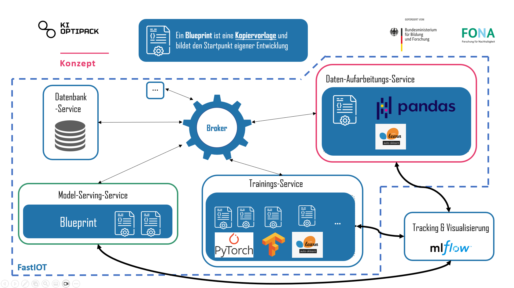

# KIOPTIPACK – DESIGN UND PRODUKTION

## Holistic AI-based optimization of plastic packaging with recycled content
In the future, packaging will need to contain a minimum of 30 percent recycled materials. 
In order to use recycled materials safely on an industrial scale, material quality must first be standardized. 
This is where the KIOptiPack — Design and Production innovation lab comes in. 
The goal is to roll out, validate and put into application practical AI-based tools for successful product design and quality production methods for plastic packaging made from a high proportion of recycled materials. 
This links up with the development of a central network platform for value creation engineering. 
The tools developed in the project target the entire value chain. 
This includes secondary raw materials, material and packaging development, process design and packaging production, as well as waste collection and treatment and consumption.

You can find more information about the project on the [KIOptiPack Website](https://ki-hub-kunststoffverpackungen.de/en/kioptipack/about)

## About this Github Repository: Blueprints

In the context of the KIOptiPack project, the IoT platform [FastIoT](https://github.com/FraunhoferIVV/fastiot) is developed ad used as a core piece of the software technology-stack.
This repository contains so-called Blueprints, which are essentially code templates to realize Machine-Learning use-cases with the FastIoT framework.
The goal of Blueprints is provide a starting point for developers to quickly implement Machine-Learning use-cases with FastIoT.

FastIoT ist a micro-service-architecture and uses a [Nats](https://nats.io/) as a message broker to communicate between services.
This architecture which introduces some peculiarities in the implementation of Machine-Learning use-cases, especially when it comes to the training of models.
The Blueprints in this repository are designed to provide Blueprints as code templates to speed up the development of Machine-Learning use-cases with FastIoT, especially for transferring and preprocessing data, training, storing and serving the models. 

## Available Blueprints

in the picture above you can see the concept of the Blueprints for Machine Learning. 
The Blueprints are divided into three main parts:

#### Database-Service
This service is responsible for storing the data and providing it to the other services. 
It is an abstraction layer between the data and the services that need it. 
This service is responsible for storing the data and providing it to the other services. 
It is an abstraction layer between the data and the services that need it. 
Putting all the DB interactions in one service enables to implement drop in replacements for different databases.
So the end user can choose between different databases without changing the other services.

#### Data-Procesing-Service
This service is responsible for processing the data.
Todo: detailed description
#### Model-Training-Service & Model-Serving-Service
These services are responsible for training the model and serving it.
Todo: detailed description

## Quickstart

### Pre-Requisites

- Python 3.9 or higher installed (in general it's recommended to use a environment manager like [conda](https://docs.anaconda.com/free/anaconda/install/windows/) or [venv](https://docs.python.org/3/library/venv.html))
- Docker installed (for example by installing [Docker Desktop](https://www.docker.com/products/docker-desktop/))
- A running Database (for example [MariaDB](https://mariadb.org/) or [MongoDB](https://www.mongodb.com/))

### Development Setup
NOTE: to run database services you need to have a running database service (for example MariaDB or MongoDB) you need to provide some environment variables, that are used to connect to the database. 
NOTE: MongoDB needs to have a username and password set up, even if your MongoDB instance does not require authentication.

1. Clone this repository
2. If working with PyCharm you have to Mark the generated src directory as “Sources Root”.
3. Install the required dependencies with `pip install -r requirements.txt`
4. Run `fiot build` 
5. Run `fiot integration_tets`
6. Start the individual services with by running the run.py files in the respective directories (for example `python src/database_mongo/run.py <<your enviorment vasriables>>`)

## Roadmap

### Completed Tasks

- [x] Conceptualization of the Blueprints
- [x] ML-Flow integration for Experiment-Tracking
- [x] WandB-Integration for Experiment-Tracking
- [x] MongoDB-Integration for ML-Data-Storage
- [x] MariaDB-Integration for ML-Data-Storage
- [x] Blueprint for Pytorch-Model-Training

### In Progress

- [ ] Blueprint for Tensorflow-Model-Training
- [ ] Blueprint for LightGBM-Model-Training

### Planned

- [ ] AutoMl-Blueprint
- [ ] Blueprint for Federated Learning
- [ ] Blueprint for Hyperparameter-Optimization
- [ ] CLI-Tool for Blueprint-Generation

## Links

- [Blueprints & Documentation of this Repo](https://blueprint-dev-v2.readthedocs.io/en/latest/index.html)
- [KIOptiPack Website (English)](https://ki-hub-kunststoffverpackungen.de/en/kioptipack/about)
- [KIOptiPack Website (German)](https://ki-hub-kunststoffverpackungen.de/kioptipack/ueber-das-projekt)
- [Gaia-X](https://gaia-x.eu/)
- [FastIoT Framework (Github)](https://github.com/FraunhoferIVV/fastiot)
- [FastIoT Framework (Documentation)](https://fastiot.readthedocs.io/en/latest/)
- [Eclipse Dataspace Connector](https://projects.eclipse.org/projects/technology.edc)