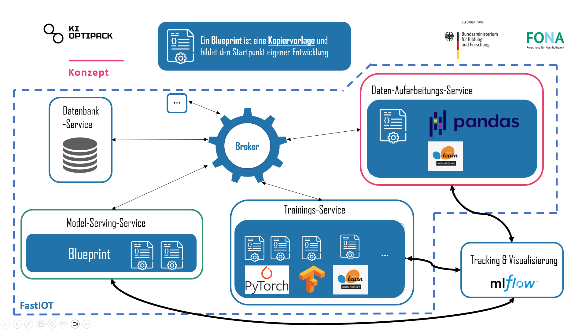

## Blueprints



n the context of the KIOptiPack project, the IoT platform [FastIoT](https://github.com/FraunhoferIVV/fastiot) is developed ad used as a core piece of the software technology-stack.
This repository contains so-called Blueprints, which are essentially code templates to realize Machine-Learning use-cases with the FastIoT framework.
The goal of Blueprints is provide a starting point for developers to quickly implement Machine-Learning use-cases with FastIoT.

FastIoT ist a micro-service-architecture and uses a [Nats](https://nats.io/) as a message broker to communicate between services.
This architecture which introduces some peculiarities in the implementation of Machine-Learning use-cases, especially when it comes to the training of models.
The Blueprints in this repository are designed to provide Blueprints as code templates to speed up the development of Machine-Learning use-cases with FastIoT, especially for transferring and preprocessing data, training, storing and serving the models. 

```{toctree}
:maxdepth: 2

blueprints-database
blueprints-dataprocessing
blueprints-ml-training
blueprints-ml-serving
blueprints-ml-consuming
```
